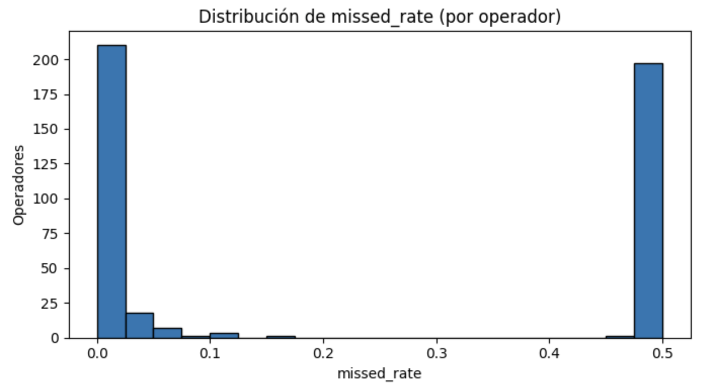
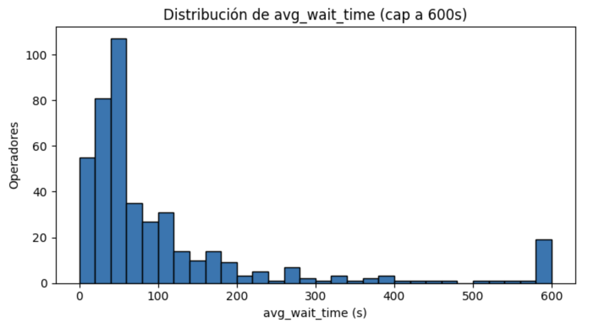
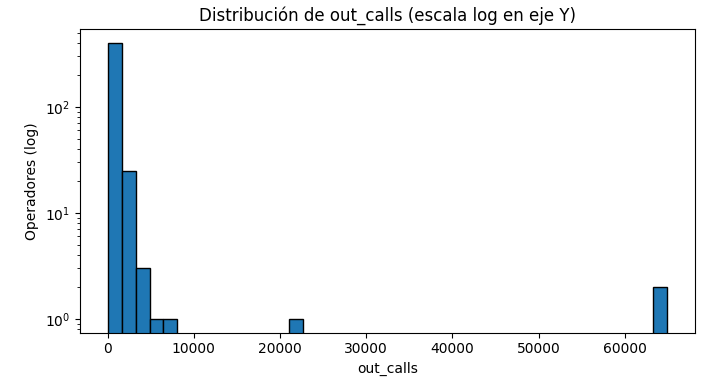

<!-- Banner -->

  
  <h1>Andrés Esquivel Díaz</h1>
  
Data Analyst | Python · SQL · Tableau · A/B Testing

  

    <a href="https://www.linkedin.com/in/andres-esquivel-diaz-08691337/" target="_blank">LinkedIn</a>
    <a href="https://github.com/aesquivel91" target="_blank">GitHub</a>
    <a href="mailto:a_esquivel_69@hotmail.com">Email</a>
    <a href="#projects">Ver proyectos</a>
  

<!-- Sobre mí -->

  <h2>Sobre mí</h2>
  

    Soy <strong>Licenciado con certificación en Análisis de Datos</strong>, con una trayectoria de <strong>13+ años liderando operaciones, análisis y optimización de procesos</strong> en el sector hotelero de lujo.
  

  

    A lo largo de mi carrera confirmé que los datos no solo describen el pasado: <strong>explican el presente y orientan el futuro</strong>. Combino la experiencia operativa —eficiencia, liderazgo y servicio— con habilidades técnicas en <strong>Python, SQL, Excel y Tableau</strong>, aplicadas en proyectos de <strong>análisis exploratorio, pruebas A/B y visualización interactiva</strong>.
  

  

    Mi enfoque está en <strong>transformar datos en estrategias accionables</strong>, optimizar recursos y contar historias que generen valor tangible para el negocio.
  

<!-- Habilidades -->

  <h2>Habilidades</h2>
  <ul>
    <li>🐍 <strong>Python</strong> (pandas, numpy, matplotlib, seaborn, plotly)</li>
    <li>💾 <strong>SQL</strong> (joins, CTEs, KPIs, consultas optimizadas)</li>
    <li>📊 <strong>Tableau / Power BI / Excel avanzado</strong> — dashboards e informes ejecutivos</li>
    <li>🧠 <strong>A/B Testing y estadística</strong> (scipy, statsmodels)</li>
    <li>⚙️ <strong>Git, GitHub, Jupyter Notebook, Streamlit</strong></li>
  </ul>

<!-- Proyectos -->

  <h2>Proyectos destacados</h2>

  <!-- Telecom -->
  

    <h3>📞 Telecomunicaciones: Identificar operadores ineficaces</h3>
    
<strong>Objetivo:</strong> Detectar operadores ineficaces para decisiones de capacitación, redistribución de carga y dimensionamiento.

    <h4>EDA — Preguntas guía</h4>
    <ol>
      <li>¿Cuántos operadores distintos existen?</li>
      <li>¿Cuántos clientes aparecen en llamadas vs. en la tabla maestra?</li>
      <li>¿Cómo se distribuye <em>direction</em> (in/out)?</li>
      <li>¿Qué porcentaje de llamadas es interna (<code>internal=True</code>)?</li>
      <li>¿Cuál es la tasa de llamadas perdidas (<code>is_missed_call=True</code>)?</li>
      <li>¿Qué planes concentran mayor actividad?</li>
    </ol>

    
El análisis inició con una exploración detallada de más de 700 clientes y 1,000 operadores. Los datos revelaron un <strong>missed rate del 39%</strong> y un crecimiento exponencial en el tráfico durante los meses pico (oct–nov). Se identificó al <strong>Plan A</strong> como el más activo, concentrando la mitad del volumen total.

    <h4>Feature Engineering y KPIs</h4>
    

      Se construyeron indicadores clave como <code>missed_rate</code>, <code>avg_wait_time</code> y <code>out_calls</code> para evaluar el desempeño individual de los operadores. Tras aplicar un filtro mínimo de exposición (≥50 llamadas entrantes), quedaron <strong>438 operadores válidos</strong>. Los resultados mostraron un <em>missed rate</em> promedio del 23%, tiempos de espera medios de 121 segundos y grandes diferencias en volumen de llamadas salientes (0 a más de 60 mil).
    

    

    

    

    <h4>Inefficiency Score</h4>
    

      Para sintetizar el rendimiento global se desarrolló un <strong>índice ponderado</strong> que combinó el <em>missed_rate</em>, el <em>wait_time</em> y las <em>out_calls</em>. Este <strong>Inefficiency Score</strong> permitió visualizar a los operadores menos eficientes, revelando que el mayor foco de ineficacia provenía de registros <strong>“Unassigned”</strong>, es decir, llamadas sin operador asignado.
    

    

    

    

    <h4>Hallazgos clave</h4>
    <ul>
      <li>El tráfico creció +1500% entre agosto y noviembre.</li>
      <li>El Plan A concentró el 50% de las llamadas activas.</li>
      <li>Se identificaron 438 operadores con exposición suficiente; el 23% presenta alto *missed rate*.</li>
      <li>El problema principal no es humano, sino de **enrutamiento** (operadores “Unassigned”).</li>
    </ul>

    <h4>Recomendaciones prácticas</h4>
    <ul>
      <li>Corregir el sistema de enrutamiento para eliminar llamadas “Unassigned”.</li>
      <li>Focalizar capacitaciones en operadores con *missed_rate* > 20%.</li>
      <li>Definir SLA claros (ej. 80% de llamadas atendidas en <30s).</li>
      <li>Implementar un dashboard en Tableau con monitoreo en tiempo real y alertas automáticas.</li>
    </ul>

    
<strong>Stack:</strong> Python · pandas · seaborn · scipy · statsmodels  
    <a href="https://github.com/aesquivel91/telecom-inefficiency-analysis" target="_blank">→ Ver en GitHub</a>

  

  <!-- A/B Test -->
  

    <h3>🅰️🅱️ AB Test — App Typography</h3>
    

      Este experimento evaluó el impacto de un cambio tipográfico en la experiencia de usuario. A través de un test A/A/B se analizaron más de 240 mil eventos y 7,500 usuarios, buscando diferencias en conversión dentro del embudo de uso de una app.
    

    

    

      El embudo evidenció que el 47.7% de los usuarios completan la compra, con la mayor pérdida entre la pantalla principal y la sección de ofertas (-38%). Este hallazgo sugiere posibles puntos de fricción en la navegación o en la relevancia de las promociones.
    

    

    

      Los resultados del test mostraron que no hubo diferencias estadísticamente significativas entre el grupo experimental (fuente nueva) y los grupos de control. Los valores p en todos los eventos fueron > 0.05, validando que el cambio no afectó negativamente el comportamiento de los usuarios.
    

    <h4>Conclusión</h4>
    

      El rediseño tipográfico no impactó de forma negativa el flujo de conversión, lo que permitió a los diseñadores implementarlo con confianza. La siguiente oportunidad de mejora identificada fue la optimización de la sección de ofertas, donde se concentra la mayor pérdida de usuarios.
    

    
<strong>Stack:</strong> Python · scipy · statsmodels · experimentación  
    <a href="https://github.com/aesquivel91/ab-test-app-typography" target="_blank">→ Ver en GitHub</a>

  

  <!-- ICE -->
  

    <h3>🎮 ICE — Análisis de Ventas de Videojuegos</h3>
    

      Este proyecto analizó más de 16 años de ventas globales de videojuegos, evaluando factores como género, plataforma, puntuaciones y clasificación ESRB. El objetivo fue identificar los elementos que predicen el éxito comercial y orientar decisiones estratégicas para campañas futuras.
    

    

    

    

    <h4>Hallazgos principales</h4>
    <ul>
      <li>Las plataformas más prometedoras en 2016 fueron **PS4, XOne y 3DS**, mientras que PS2, PS3 y Wii entraron en declive.</li>
      <li>Los géneros **Action, Sports y Shooter** lideraron en ventas globales; **Role-Playing** destacó en Japón.</li>
      <li>Las reseñas de críticos mostraron una correlación positiva más fuerte con las ventas que las de usuarios.</li>
      <li>Las campañas futuras deberían enfocarse en plataformas activas y adaptar contenido según la región.</li>
    </ul>

    
<strong>Stack:</strong> Python · pandas · plotly  
    <a href="#" title="Repositorio próximamente">→ Ver en GitHub</a>

  

<footer>© 2025 Andrés Esquivel Díaz · Hecho con GitHub Pages</footer>

