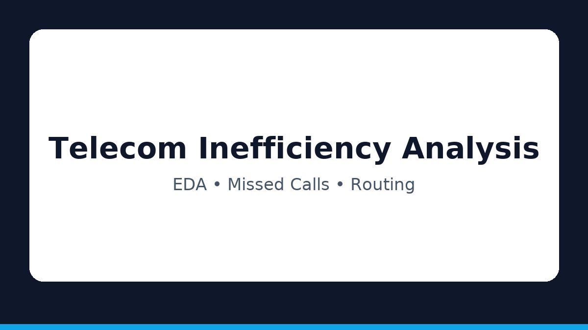
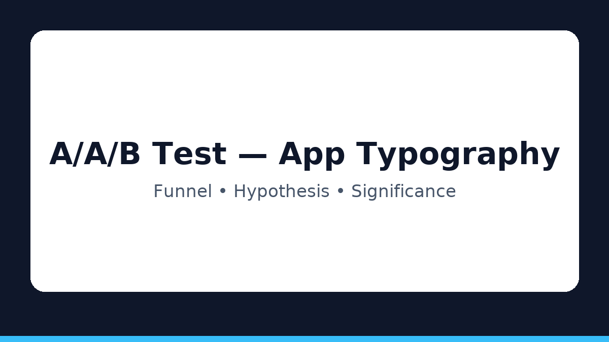
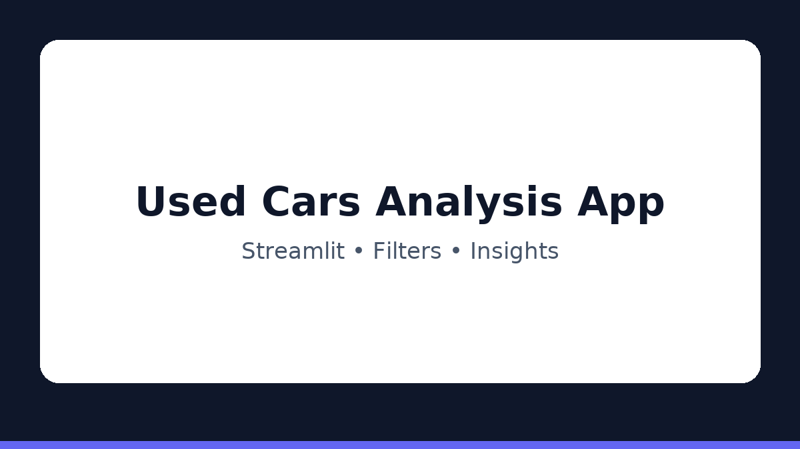

<link rel="icon" href="assets/img/favicon.png">

---
layout: default
title: "Andrés Esquivel Díaz"
---

# Andrés Esquivel Díaz  
**Data Analyst | Python · SQL · Tableau**

Transformo datos en estrategias para mejorar la eficiencia y las decisiones de negocio.

  
  
  
  

  <a href="https://www.linkedin.com/in/andres-esquivel-diaz-08691337/" target="_blank">LinkedIn</a>
  <a href="https://github.com/aesquivel91" target="_blank">GitHub</a>
  <a href="mailto:andresesquiveldata@gmail.com">Email</a>
  <a href="#projects">Ver proyectos</a>

---

## Sobre mí
Licenciado con certificación en **Análisis de Datos** y **13+ años** en hospitalidad (reservaciones y operaciones).  
Me especializo en **EDA**, **visualización**, **A/B Testing** y **storytelling con datos** para potenciar decisiones y eficiencia.

---

## Habilidades
- Python (pandas, numpy, matplotlib, seaborn), SQL  
- Visualización: Tableau, Plotly, Excel avanzado  
- A/B Testing: scipy, statsmodels  
- Entornos: Jupyter, Anaconda, Streamlit  
- Git & GitHub · Documentación reproducible (README, requirements)

---

## Proyectos destacados {#projects}

  

    
    <h3>📞 Telecom Inefficiency Analysis</h3>
    

      Análisis exploratorio para detectar ineficiencias, <em>missed calls</em> y problemas de enrutamiento.  
      Recomendaciones accionables para priorizar operadores y mejorar reglas.
    

    

      
EDA

      
Pruebas de hipótesis

      
Visualización

    

    
<a class="btn-row" href="https://github.com/aesquivel91/telecom-inefficiency-analysis" target="_blank">Ver en GitHub</a>

  

  

    
    <h3>🅰️🅱️ AB Test App Typography</h3>
    

      Test A/A/B para evaluar impacto de cambios tipográficos en el embudo de conversión.  
      Validación estadística con <code>scipy</code> y <code>statsmodels</code>.
    

    

      
Embudo

      
A/A/B

      
Significancia

    

    
<a class="btn-row" href="https://github.com/aesquivel91/ab-test-app-typography" target="_blank">Ver en GitHub</a>

  

  

    
    <h3>🚗 Aplicación Análisis de Vehículos Usados</h3>
    

      App en Streamlit para explorar listados de autos usados en EE.UU.  
      Filtros por precio, año, marca y características para descubrir patrones.
    

    

      
Streamlit

      
EDA

      
UI interactiva

    

    
<a class="btn-row" href="https://github.com/aesquivel91/Aplicacion_Analisis_de_vehiculos_usados" target="_blank">Ver en GitHub</a>

  

---

## Experiencia breve
Más de 13 años en **hospitalidad** (One&Only Palmilla), liderazgo de equipos, optimización de procesos y foco en experiencia cliente.

---

## Contacto
**Email:** [andresesquiveldata@gmail.com](mailto:andresesquiveldata@gmail.com)  
**GitHub:** [@aesquivel91](https://github.com/aesquivel91) · **LinkedIn:** [Perfil](https://www.linkedin.com/in/andres-esquivel-diaz-08691337/)

---

<footer>© 2025 Andrés Esquivel Díaz · Hecho con GitHub Pages</footer>
