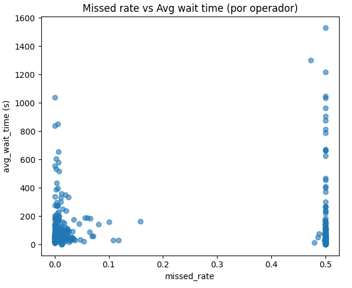
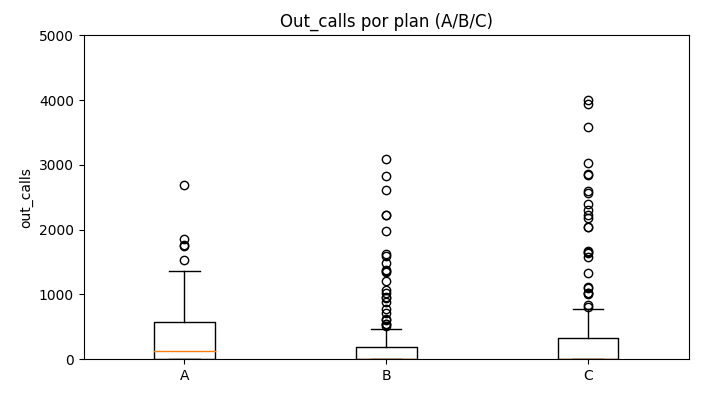

<!-- Banner -->

  
  <h1>Andrés Esquivel Díaz</h1>
  
Data Analyst | Python · SQL · Tableau · A/B Testing

  

    <a href="https://www.linkedin.com/in/andres-esquivel-diaz-08691337/" target="_blank">LinkedIn</a>
    <a href="https://github.com/aesquivel91" target="_blank">GitHub</a>
    <a href="mailto:a_esquivel_69@hotmail.com">Email</a>
    <a href="#projects">Ver proyectos</a>
  

<!-- Sobre mí -->

  <h2>Sobre mí</h2>
  

    Soy <strong>Licenciado con certificación en Análisis de Datos</strong>, con una trayectoria de
    <strong>13+ años liderando operaciones, análisis y optimización de procesos</strong> en el sector hotelero de lujo.
  

  

    Combino la experiencia práctica en eficiencia, liderazgo y servicio con habilidades técnicas en <strong>Python, SQL, Excel y Tableau</strong>,
    aplicadas en proyectos de <strong>análisis exploratorio, pruebas A/B y visualización interactiva</strong>. Mi enfoque está en
    <strong>transformar datos en estrategias accionables</strong>, optimizar recursos y contar historias con datos que generen valor real para el negocio.
  

<!-- Habilidades -->

  <h2>Habilidades</h2>
  <ul>
    <li>🐍 <strong>Python</strong> (pandas, numpy, matplotlib, seaborn, plotly)</li>
    <li>💾 <strong>SQL</strong> (joins, CTEs, KPIs, consultas optimizadas)</li>
    <li>📊 <strong>Tableau / Power BI / Excel avanzado</strong> — dashboards e informes ejecutivos</li>
    <li>🧠 <strong>A/B Testing y estadística</strong> (scipy, statsmodels)</li>
    <li>⚙️ <strong>Git, GitHub, Jupyter Notebook, Streamlit</strong></li>
  </ul>

<!-- Proyectos -->

  <h2>Proyectos destacados</h2>

  <!-- Telecom -->
  

    <h3>📞 Telecomunicaciones: Identificar operadores ineficaces</h3>
    
<strong>Objetivo:</strong> Detectar operadores ineficaces para orientar <em>coaching</em>, redistribución de carga y dimensionamiento.

    <h4>EDA — Preguntas guía</h4>
    <ol>
      <li>¿Cuántos operadores distintos existen?</li>
      <li>¿Cuántos clientes aparecen en llamadas vs. en la tabla maestra?</li>
      <li>¿Cómo se distribuye <em>direction</em> (in/out)?</li>
      <li>¿Qué porcentaje de llamadas es interna (<code>internal=True</code>)?</li>
      <li>¿Cuál es la tasa de llamadas perdidas en entrantes (<code>is_missed_call=True</code>)?</li>
      <li>¿Qué planes concentran mayor actividad?</li>
    </ol>

    <h4>EDA y limpieza inicial</h4>
    <ul>
      <li>Actividad de clientes: <strong>307/732</strong> con llamadas.</li>
      <li>Operadores únicos: <strong>1,093</strong>.</li>
      <li>Dirección de llamadas: <strong>59% salientes / 41% entrantes</strong>.</li>
      <li>Naturaleza: <strong>11% internas</strong>; resto externas.</li>
      <li><strong>Missed rate (entrantes): 39.3%</strong> — nivel elevado.</li>
      <li>Evolución temporal: crecimiento de &lt;1k a &gt;15k llamadas/día (oct–nov).</li>
      <li>Planes: <strong>Plan A ≈ 50%</strong> del volumen.</li>
      <li>Limpieza: imputación de <code>internal</code> nulos como <code>False</code>.</li>
    </ul>

    <h4>Feature engineering y KPIs</h4>
    <ul>
      <li>KPIs por operador: <code>missed_rate</code>, <code>avg_wait_time</code> y <code>out_calls</code>.</li>
      <li>Filtro de exposición: ≥ 50 entrantes → <strong>438 operadores válidos</strong>.</li>
      <li>Descriptivos: <em>missed_rate</em> medio ≈ 23%; <em>avg_wait_time</em> medio ≈ 121 s; <em>out_calls</em> muy desigual (0 → &gt;60k).</li>
      <li>Se etiquetan vacíos de <code>operator_id</code> como <strong>“Unassigned”</strong>.</li>
    </ul>

    <h4>KPIs por operador</h4>
    
<strong>1) Histograma de missed_rate</strong> — bimodal (≈0.0 y ≈0.5), pico asociado a <em>Unassigned</em> → problema de asignación/enrutamiento.

    

    
<strong>2) Histograma de avg_wait_time</strong> (cap 600 s) — sesgo a la derecha; masa 20–120 s, cola larga ≥300 s → fijar SLA (80% &lt; 30 s) y alertas &gt; 60 s.

    

    
<strong>3) Histograma de out_calls</strong> (log) — mayoría con 0–200; pocos outliers muy altos → roles distintos; normalizar por tiempo/turno.

    

    
<strong>4) Dispersión missed_rate vs avg_wait_time</strong> — dos bandas y correlación débil inversa → misses “rápidos”/enrutamiento.

    

    
<strong>5) Boxplot de out_calls por plan (A/B/C)</strong> — medianas bajas y gran dispersión; A &gt; B; C heterogéneo → objetivos por plan/rol.

    

    <h4>Inefficiency Score</h4>
    <ul>
      <li>Índice ponderado: 0.4·missed_norm + 0.4·wait_norm + 0.2·(1 – out_norm); umbral &gt; 0.70.</li>
      <li>Top 20 dominado por <strong>“Unassigned”</strong> (missed ≈ 50%, esperas &gt; 1000 s, pocas salientes).</li>
      <li><strong>Insight:</strong> el foco de ineficacia es sistémico (enrutamiento), no solo de desempeño individual.</li>
    </ul>

    <h4>Pruebas de hipótesis</h4>
    <ul>
      <li><strong>H1</strong> (Spearman): ρ = −0.132, p = 0.0058 → correlación débil e inversa.  
        

</li>
      <li><strong>H2</strong> (Mann–Whitney U): p = 0.0005 → Plan A &gt; Plan B en llamadas salientes.  
        

</li>
      <li><strong>H3</strong> (Kruskal–Wallis): p &lt; 0.0001 → externas con mayor espera que internas.  
        

</li>
    </ul>

    <h4>Recomendaciones prácticas</h4>
    <ul>
      <li>Corregir enrutamiento “Unassigned”.</li>
      <li>Coaching para <em>missed_rate</em> &gt; 20% o <em>avg_wait_time</em> &gt; 60 s.</li>
      <li>Ajustar objetivos outbound por plan/rol (especialmente Plan B).</li>
      <li>Definir SLAs por plan (ej. 80% &lt; 30 s) y reforzar turnos en picos.</li>
      <li>Dashboard en Tableau + Watchlist para seguimiento continuo.</li>
    </ul>

    

      Python · pandas · seaborn · scipy · statsmodels
      <a href="https://github.com/aesquivel91/telecom-inefficiency-analysis" target="_blank">Ver en GitHub</a>
    

  

  <!-- A/B Test -->
  

    <h3>🅰️🅱️ AB Test — App Typography</h3>
    
<strong>Objetivo:</strong> Evaluar si el cambio de tipografía afecta el comportamiento de los usuarios a lo largo del embudo de conversión.

    <h4>Embudo</h4>
    <ol>
      <li>MainScreenAppear — pantalla principal</li>
      <li>OffersScreenAppear — navegación de ofertas</li>
      <li>CartScreenAppear — carrito</li>
      <li>PaymentScreenSuccessful — pago exitoso</li>
    </ol>
    
Se mide llegada a cada etapa y conversión entre pasos para identificar fugas.

    

    <h4>Resultados A/B</h4>
    
Comparación entre grupo experimental (248) y controles (246 + 247) mediante pruebas Z de proporciones:

    <table>
      <thead><tr><th>Evento</th><th>Experimental</th><th>Control</th><th>Z</th><th>p</th></tr></thead>
      <tbody>
        <tr><td>Tutorial</td><td>11.00%</td><td>11.23%</td><td>-0.299</td><td>0.7649</td></tr>
        <tr><td>MainScreenAppear</td><td>98.27%</td><td>98.58%</td><td>-1.049</td><td>0.2942</td></tr>
        <tr><td>OffersScreenAppear</td><td>60.35%</td><td>61.28%</td><td>-0.782</td><td>0.4343</td></tr>
        <tr><td>CartScreenAppear</td><td>48.48%</td><td>50.11%</td><td>-1.335</td><td>0.1818</td></tr>
        <tr><td>PaymentScreenSuccessful</td><td>46.55%</td><td>47.19%</td><td>-0.524</td><td>0.6004</td></tr>
      </tbody>
    </table>
    
<strong>Conclusión:</strong> no se detectan diferencias significativas (todos los p &gt; 0.05).

    

    <h4>Significancia</h4>
    
Se usó α = 0.05. Se realizaron 20 pruebas (A/A y A/B). Como ningún p &lt; .05, no se requiere corrección por múltiples comparaciones (Bonferroni o Benjamini–Hochberg).

    <h4>Recomendación</h4>
    
El equipo de diseño puede <strong>implementar la nueva tipografía</strong> con confianza. Sugerido: profundizar en la etapa de <em>Offers</em>, donde se observa mayor fuga.

    

      Python · scipy · statsmodels · experimentación
      <a href="https://github.com/aesquivel91/ab-test-app-typography" target="_blank">Ver en GitHub</a>
    

  

  <!-- ICE -->
  

    <h3>🎮 ICE — Análisis de Ventas de Videojuegos</h3>
    
<strong>Objetivo:</strong> Identificar factores de éxito (ventas, reseñas, plataformas, géneros, ESRB) para decisiones comerciales en 2017.

    <h4>EDA</h4>
    <ul>
      <li>Conversión de <code>year_of_release</code> a entero y limpieza de <code>user_score</code> (“tbd” → NaN → float).</li>
      <li>Eliminación de filas sin <em>name</em> o <em>genre</em>; sin imputación de <em>scores</em> por posible sesgo.</li>
    </ul>

    <h4>Segmentación</h4>
    <ul>
      <li><strong>PS4</strong> y <strong>XOne</strong> dominan el periodo reciente → foco de campañas y lanzamientos.</li>
      <li><strong>3DS/WiiU</strong> relevantes en JP (nichos portátiles); <strong>PSV</strong> con oportunidades específicas.</li>
      <li>Plataformas históricas (PS2, PS3, Wii, X360) en declive → evitar en campañas nuevas.</li>
      <li><strong>PC</strong>: caída en físico por auge digital → priorizar estrategia online.</li>
    </ul>

    

    

    

    <h4>Insights y conclusiones</h4>
    <ul>
      <li>Lanzamientos crecen hasta 2009 y caen después; para tendencias confiables se usa info hasta 2015.</li>
      <li>NA/EU: prefieren consolas domésticas y géneros Action/Shooter/Sports; JP: portátiles y RPG.</li>
      <li>Reseñas de críticos correlacionan más con ventas que las de usuarios → priorizar prensa especializada.</li>
      <li>Estrategia 2017: priorizar PS4, XOne y 3DS; reservar plataformas en declive para catálogo retro.</li>
    </ul>

    

      Python · pandas · plotly
      <a href="#" title="Repositorio próximamente">GitHub</a>
    

  

<footer>© 2025 Andrés Esquivel Díaz · Hecho con GitHub Pages</footer>

