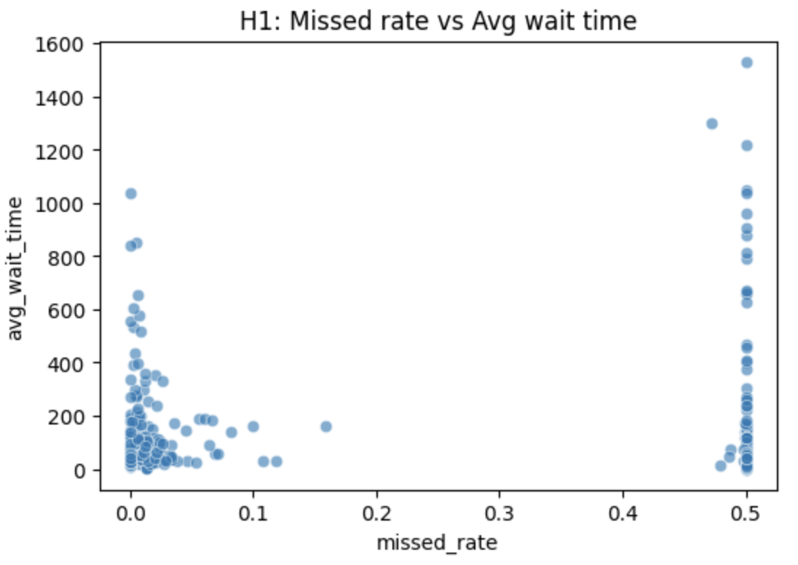
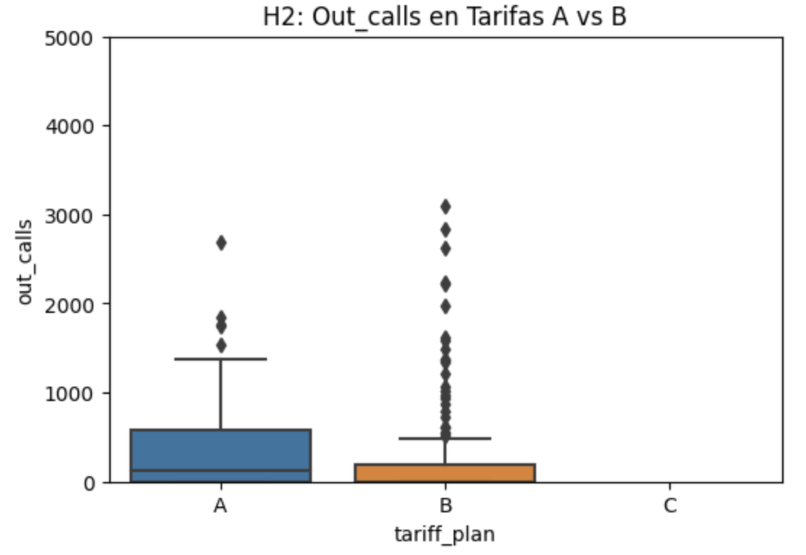
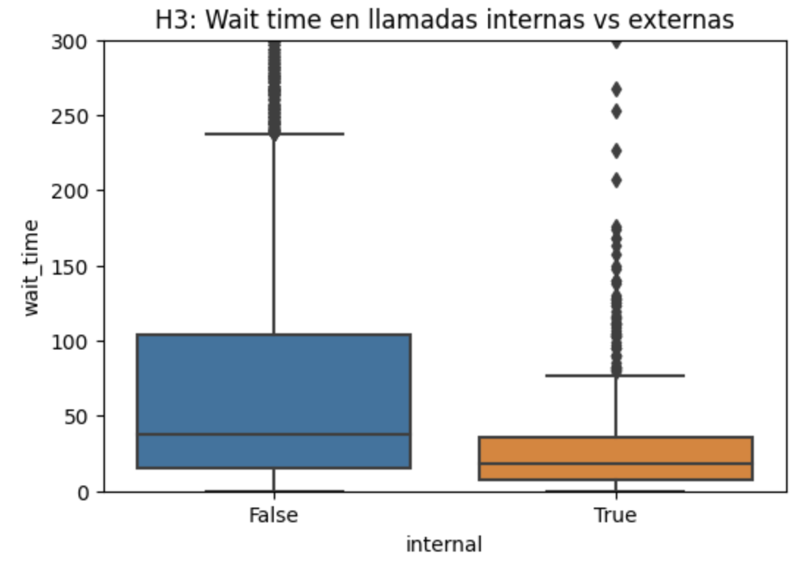
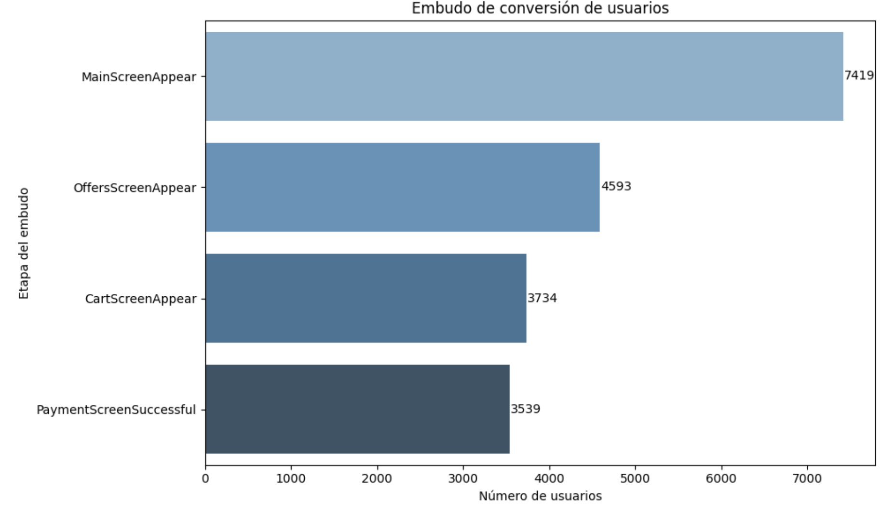
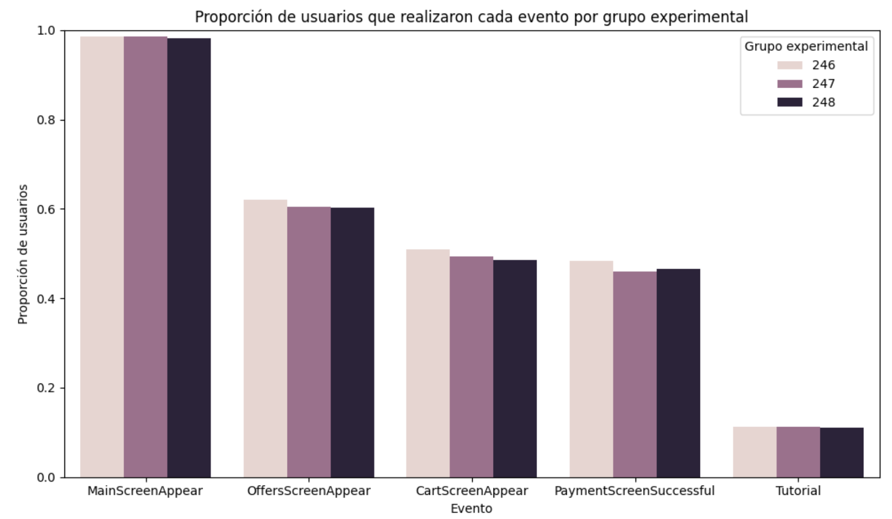
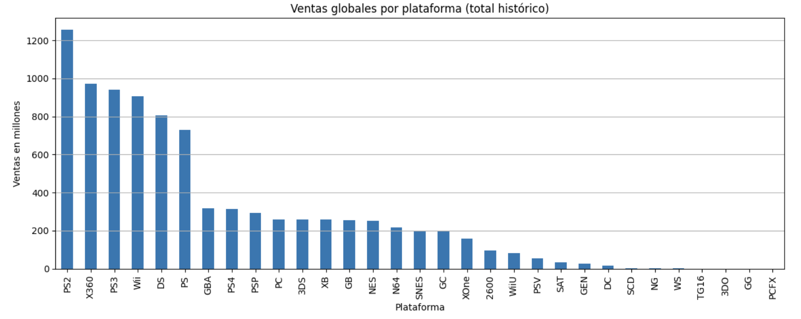
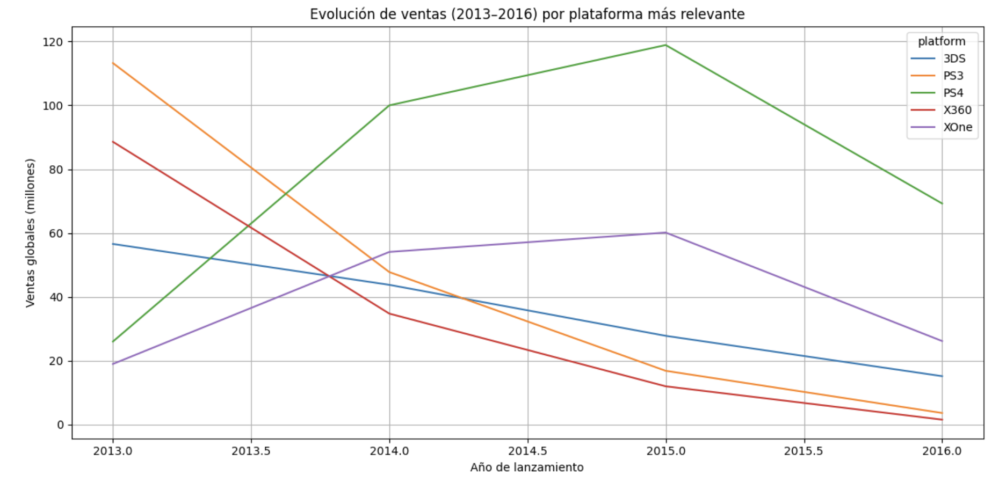
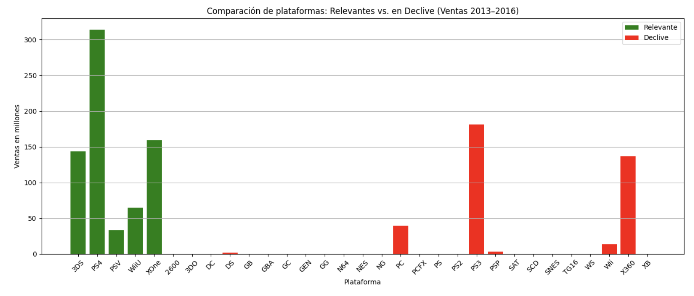

<!-- ===== Hero ===== -->

  
  <h1>Andrés Esquivel Díaz</h1>
  
Data Analyst | Python · SQL · Tableau · A/B Testing

  

    <a href="https://www.linkedin.com/in/andres-esquivel-diaz-08691337/" target="_blank">LinkedIn</a>
    <a href="https://github.com/aesquivel91" target="_blank">GitHub</a>
    <a href="mailto:andresesquiveldata@gmail.com">Email</a>
    <a href="#projects">Ver proyectos</a>
  

<!-- ===== Índice flotante ===== -->

  <h4>Secciones</h4>
  <a href="#sobre-mi">Sobre mí</a>
  <a href="#habilidades">Habilidades</a>
  <a href="#projects">Proyectos</a>
  <a href="#telecom">📞 Telecom</a>
  <a href="#abtest">🅰️🅱️ A/B Test</a>
  <a href="#ice">🎮 ICE Games</a>

<!-- ===== SOBRE MÍ ===== -->

  <h2>Sobre mí</h2>
  

    Soy <strong>Licenciado con certificación en Análisis de Datos</strong>, con más de <strong>13 años de experiencia liderando operaciones,
    análisis y optimización de procesos</strong> en el sector hotelero de lujo.
  

  

    Mi transición al mundo del <strong>Data Analytics</strong> surge del deseo de transformar la intuición operativa en decisiones
    basadas en evidencia. Combino mi visión estratégica, enfoque en eficiencia y liderazgo con habilidades técnicas en <strong>Python, SQL,
    Excel y Tableau</strong> para resolver problemas complejos, encontrar patrones ocultos y traducir datos en <strong>acciones medibles y rentables</strong>.
  

  

    Mi objetivo es <strong>impulsar la toma de decisiones data-driven</strong>, optimizar recursos y crear narrativas visuales que
    conecten los datos con la estrategia de negocio.
  

<!-- ===== HABILIDADES ===== -->

  <h2>Habilidades</h2>
  <ul>
    <li>🐍 <strong>Python</strong> — pandas, numpy, matplotlib, seaborn, plotly</li>
    <li>💾 <strong>SQL</strong> — joins, CTEs, KPIs y consultas optimizadas</li>
    <li>📊 <strong>Tableau / Power BI / Excel avanzado</strong> — dashboards, storytelling y reportes ejecutivos</li>
    <li>🧠 <strong>A/B Testing y estadística</strong> — scipy, statsmodels, pruebas Z, U, Kruskal–Wallis</li>
    <li>⚙️ <strong>Git, GitHub, Jupyter Notebook, Streamlit</strong></li>
  </ul>

<!-- ===== PROYECTOS ===== -->

  <h2>Proyectos destacados</h2>

  <!-- Proyecto 1 -->
  

    <h3>📞 Telecomunicaciones — Detección de operadores ineficaces</h3>
    

      <strong>Objetivo:</strong> Identificar operadores ineficaces para orientar decisiones de capacitación, redistribución de carga y optimización del servicio.
    

    

      Se realizó un <strong>análisis exploratorio (EDA)</strong> sobre más de 700 clientes y 1,000 operadores, evaluando llamadas entrantes, salientes y tiempos de espera.
      A través de pruebas estadísticas (Spearman, Mann–Whitney U, Kruskal–Wallis) se determinaron patrones de desempeño e ineficiencia.
    

    <h4>Visualizaciones</h4>
    

    

    

    <h4>Principales hallazgos</h4>
    <ul>
      <li>El tráfico de llamadas creció significativamente entre agosto y noviembre de 2019, superando 15k llamadas diarias.</li>
      <li>Solo 307 de 732 clientes mostraron actividad; el <strong>Plan A</strong> concentró cerca del 50% del volumen total.</li>
      <li>El <strong>missed rate promedio fue 23%</strong> y el tiempo medio de espera 121 s, revelando áreas críticas de mejora.</li>
      <li>Los registros “Unassigned” explican gran parte de la ineficiencia, evidenciando problemas de enrutamiento.</li>
    </ul>

    <h4>Impacto y recomendaciones</h4>
    <ul>
      <li>Reconfigurar el enrutamiento y reducir la proporción de llamadas sin operador asignado.</li>
      <li>Capacitación focalizada en operadores con tasas de espera altas (&gt;60s) o missed_rate &gt;20%.</li>
      <li>Definir <strong>SLAs específicos</strong> por plan de cliente (ej. 80% llamadas atendidas &lt;30s).</li>
      <li>Implementar dashboard en Tableau para monitoreo continuo y alertas.</li>
    </ul>

    

      Python · pandas · seaborn · scipy
      <a href="https://github.com/aesquivel91/telecom-inefficiency-analysis" target="_blank">Ver en GitHub</a>
    

  

  <!-- Proyecto 2 -->
  

    <h3>🅰️🅱️ A/B Test — App Typography</h3>
    

      <strong>Objetivo:</strong> Evaluar si un cambio en la tipografía de una aplicación afecta el comportamiento de los usuarios a lo largo del embudo de conversión.
    

    

      Se diseñó un <strong>test A/A/B</strong> con más de 2,400 usuarios para medir diferencias entre grupos de control y experimental.
      Se analizaron eventos clave: navegación, carrito y pago exitoso, mediante pruebas Z de proporciones.
    

    <h4>Embudo de conversión</h4>
    

    <h4>Resultados</h4>
    

    

      No se observaron diferencias estadísticamente significativas (<em>p&gt;0.05</em>) entre grupos, confirmando la estabilidad del rendimiento tras el cambio visual.
    

    <h4>Conclusión e impacto</h4>
    <ul>
      <li>El cambio de tipografía no afecta negativamente el flujo de usuarios ni la conversión final.</li>
      <li>El equipo de diseño puede <strong>implementar el nuevo estilo</strong> sin riesgo para las métricas clave.</li>
      <li>Se recomienda profundizar en la etapa de <em>OffersScreen</em>, donde se detecta mayor abandono.</li>
    </ul>

    

      Python · scipy · statsmodels · A/B Testing
      <a href="https://github.com/aesquivel91/ab-test-app-typography" target="_blank">Ver en GitHub</a>
    

  

  <!-- Proyecto 3 -->
  

    <h3>🎮 ICE — Análisis de ventas de videojuegos</h3>
    

      <strong>Objetivo:</strong> Identificar los factores que determinan el éxito de un videojuego a partir de datos históricos de ventas, reseñas, plataformas y géneros.
      Este estudio orienta las decisiones estratégicas de la tienda <em>Ice</em> para campañas comerciales en 2017.
    

    <h4>Exploración y limpieza de datos</h4>
    

      Se transformaron columnas clave (<code>year_of_release</code>, <code>user_score</code>) para permitir análisis estadístico.
      Se eliminaron filas con valores faltantes en nombre o género, garantizando consistencia en los resultados.
    

    <h4>Segmentación y visualización</h4>
    <ul>
      <li><strong>PS4</strong> y <strong>XOne</strong> lideran el mercado reciente; deben ser el foco de nuevas campañas.</li>
      <li><strong>3DS</strong> y <strong>WiiU</strong> mantienen relevancia en Japón; oportunidades en nichos portátiles.</li>
      <li><strong>PC</strong> muestra caída en ventas físicas por digitalización; adaptar estrategia al formato online.</li>
    </ul>

    

    

    

    <h4>Conclusiones e insights</h4>
    <ul>
      <li>Las plataformas activas y en crecimiento (PS4, XOne, 3DS) deben concentrar la inversión publicitaria.</li>
      <li>Los géneros <strong>Action, Shooter y Sports</strong> son los más rentables en NA y EU; <strong>Role-Playing</strong> domina en Japón.</li>
      <li>Las reseñas de críticos correlacionan más con ventas que las de usuarios → priorizar prensa especializada.</li>
      <li>Las plataformas en declive (PS2, PS3, Wii, X360) deben reservarse para catálogos retro.</li>
    </ul>

    

      Python · pandas · plotly
      <a href="#" title="Repositorio próximamente">GitHub</a>
    

  

<footer>© 2025 Andrés Esquivel Díaz · Hecho con GitHub Pages</footer>

